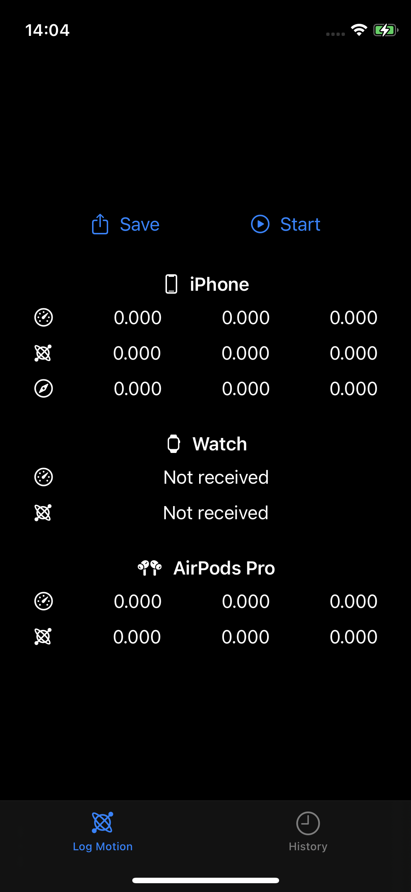
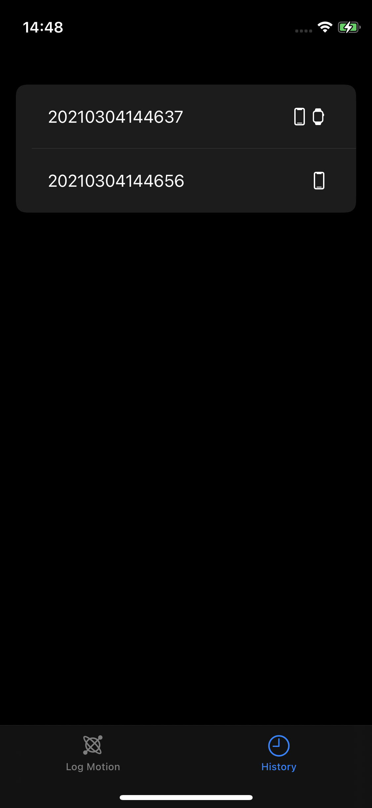
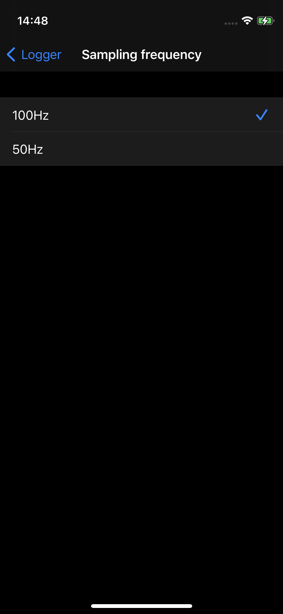
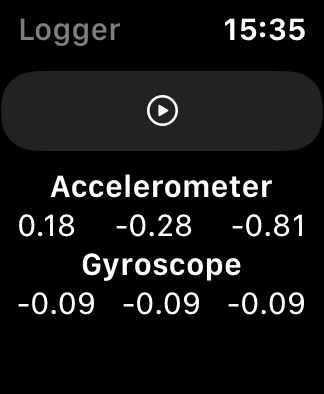
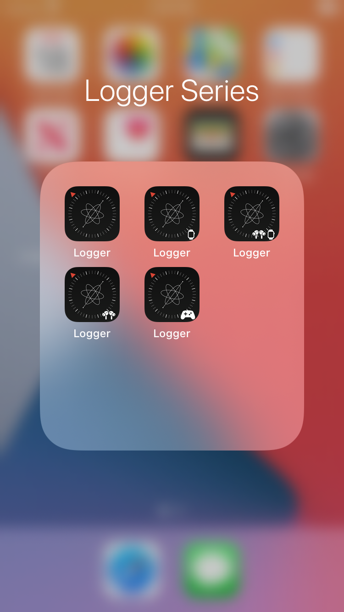

#  Logger

This application can measure acceleraton data, gyroscope data and magnetic data, and save them in CSV file.

Logger for [iOS](https://github.com/Shakshi3104/Logger5) + [watchOS](https://github.com/Shakshi3104/Logger-Watch)

### Logger for iOS
Home | History | Setting App
:-:|:-:|:-:
| |

### Logger for watchOS

## Version

7.4.0

## Requirements
- iOS 14.0+
- watchOS 7.0+
- Xcode 12.0+

## Update History

|Version|Update Date|Contents|
|:----:|:-------------:|:---------|
|6.0.0|2020/8/2| Connect [Logger5](https://github.com/Shakshi3104/Logger5) and [Logger-Watch](https://github.com/Shakshi3104/Logger-Watch) simply|
|6.1.0|2020/8/2| Implement the function to transfer data from Apple Watch to iPhone and save to CSV file|
|7.0.0|2020/9/28| Added the function to record the motion of the AirPods Pro implemented in [Logger5](https://github.com/Shakshi3104/Logger5) |
|7.1.0|2020/10/27| Added the function to change the sampling frequency in Settings app |
|7.2.0|2020/10/30| Improved UI and fixed a bug that occurs in iOS 14 |
|7.3.0|2021/1/13|<ul><li>Implemented Extended Runtime Session (watchOS)</li><li>Stop button is only available by double tapping or long pressing (iOS)</li></ul> |
|7.3.1|2020/1/19|Changed to send the data together after the measurement is finished |
|7.3.2|2020/3/3|Fix a serious bug related to data saving|
|7.4.0|2020/3/4|Add history|

## Logger Series
- [Logger-storyboard](https://github.com/Shakshi3104/LoggerGit) : Logger implemented using Storyboard, available on iOS 10+.
- [Logger-SwiftUI](https://github.com/Shakshi3104/Logger5) : Logger implemented using SwiftUI, available on iOS 13+.
- [Logger-for-watch](https://github.com/Shakshi3104/Logger-Watch) : Logger for Apple Watch, implemented using SwiftUI, available on watchOS 6.0+.
- [Logger-with-watch](https://github.com/Shakshi3104/Logger6) : Logger for iPhone and Apple Watch, implemented using SwiftUI, available on iOS 13.0+ and watchOS 6.0+.
- [Logger-with-AirPods Pro](https://github.com/Shakshi3104/Logger5/tree/headphone) : Logger for iPhone and AirPods Pro, implemented using SwiftUI, available on iOS 14.0+.
- [Logger-all-device](https://github.com/Shakshi3104/Logger7) : Logger for iPhone, Apple Watch, and AirPods Pro, implemented using SwiftUI, available on iOS 14.0+ and watchOS 7.0+.

|Logger Series|
|:--------------:|
||
