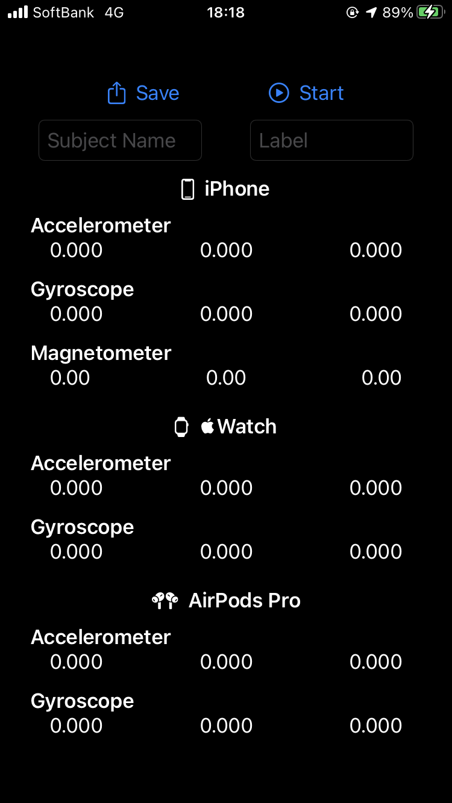
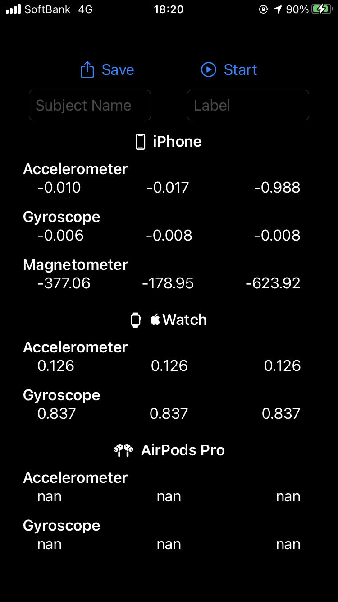

#  Logger

This application can measure acceleraton data, gyroscope data and magnetic data, and save them in CSV file.

Logger for [iOS](https://github.com/Shakshi3104/Logger5) + [watchOS](https://github.com/Shakshi3104/Logger-Watch)

### Logger for iOS
|
:-:|:-:

### Logger for watchOS

## Version

7.0.0

## Requirements
- iOS 14.0+
- watchOS 7.0+
- Xcode 12.0+

## Update History

|Version|Update Date|Contents|
|:----:|:-------------:|:---------|
|6.0.0|2020/8/2| Connect [Logger5](https://github.com/Shakshi3104/Logger5) and [Logger-Watch](https://github.com/Shakshi3104/Logger-Watch) simply|
|6.1.0|2020/8/2| Implement the function to transfer data from Apple Watch to iPhone and save to CSV file|
|7.0.0|2020/9/28| Added the function to record the motion of the AirPods Pro implemented in [Logger5](https://github.com/Shakshi3104/Logger5) |

